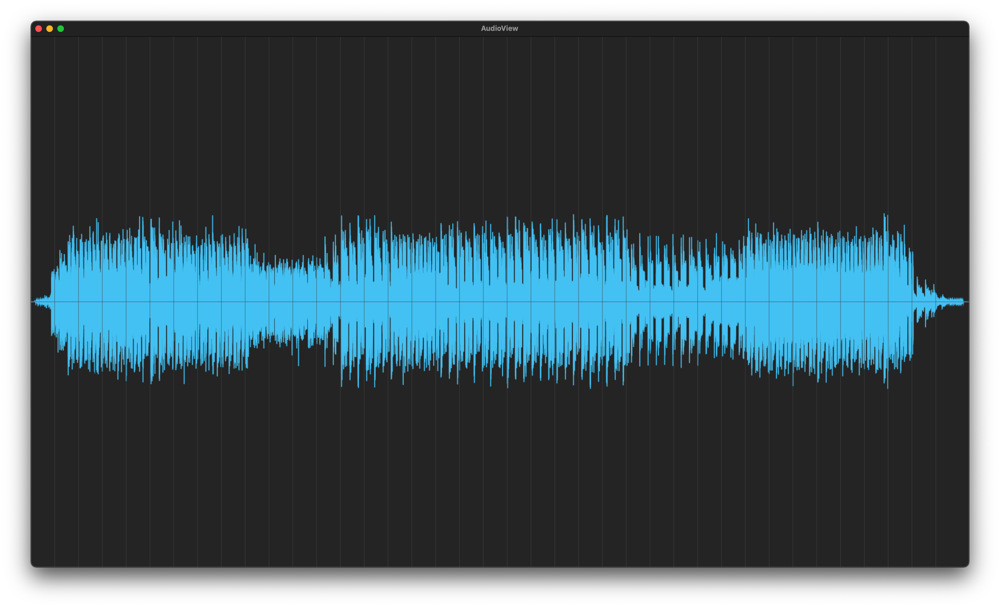

# AudioView

A SwiftUI project for Macos to View an Audio file (filetypes currently allowed: mp3, wav, aiff, m4a)

Select "Open Audio File" from the menu and it'll generate a waveform view.

This project was created as an exercise in SwiftUI.

- - -

Effectively it's just a [Spike](https://wiki.c2.com/?SpikeDescribed), as I have little to no idea how to do audiofile -> waveform render, other than some intuition that it's some sort of cartesian plot of the sample amplitude over time.

There is zero little in the way of service to testability / tests.

- - -

I have an idea how input / output could be e2e tested, for example maybe generate a square wave audio file for <100ms and see that the sample values get pushed towards 1 and -1 in alternate sequence.

But I'm speculating, I don't know what's customary in audio programming, I wonder if there's a community of XP / TDD engineers who do audio!?

# Licence

MIT
